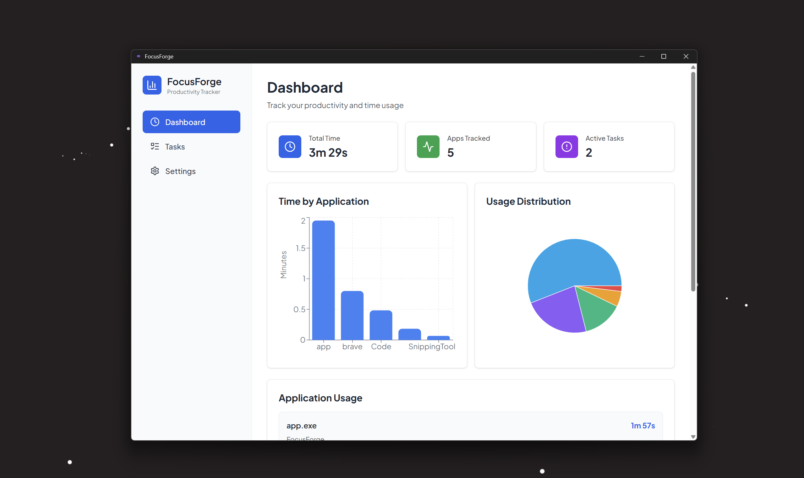
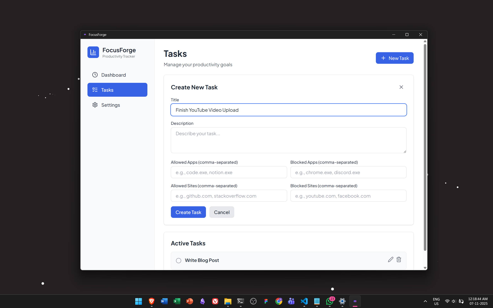
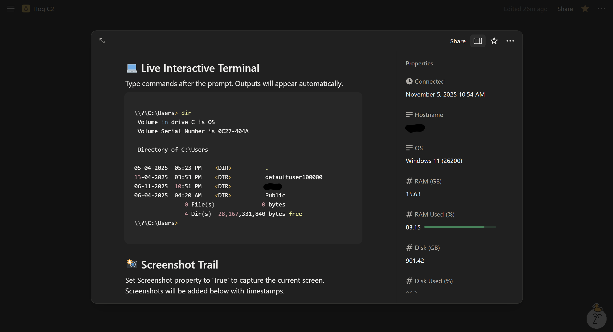
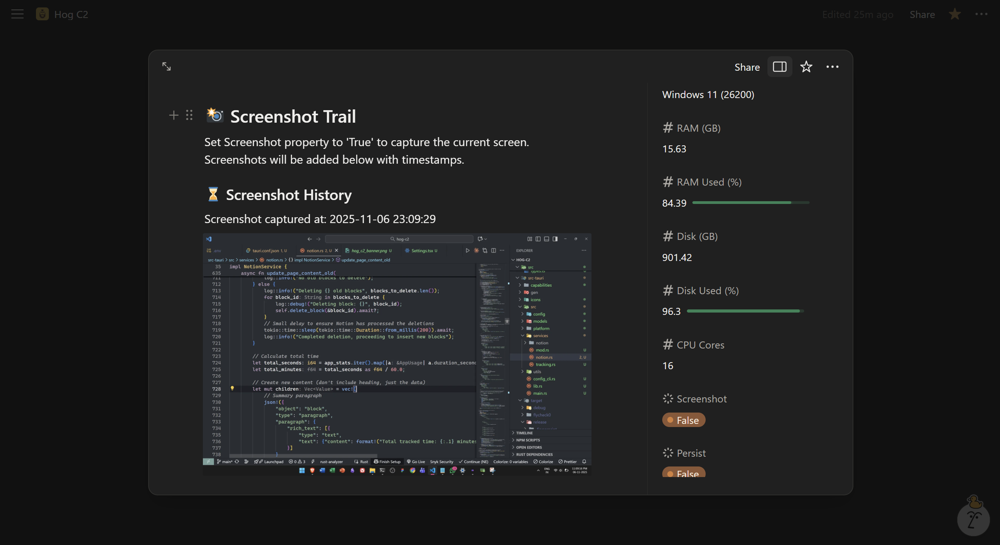

<div align="center">
<h1>🐗 Hog C2</h1> 


**Living Off Trusted Sites: Data Exfiltration via SaaS Infrastructure**

*Security Research | Red Team Operations | Authorized Testing Only*

[](https://github.com)
[](https://tauri.app/)

[Technical Overview](#technical-overview) • [Detection Evasion](#detection-evasion-analysis) • [Setup Guide](./SETUP_GUIDE.md) • [Research Background](#research-background)

</div>

---

## Why we built this?

You've spent weeks developing your implant. Custom syscalls to bypass EDR hooks. Sleep obfuscation to evade behavioral analysis. Maybe even a kernel-mode rootkit for persistence. You've successfully deployed to the target, established your beachhead, and escalated privileges.

**Now you need to exfiltrate data. And this is where everything falls apart.**

Modern network security doesn't just live at the endpoint. The moment your implant tries to send that 50MB database dump back to your C2 server at `evil-domain.xyz`, you hit:

### Defense in Depth: The Network Perimeter

**Next-Generation Firewalls (NGFW):**
- Deep Packet Inspection (DPI) with SSL/TLS decryption
- Application-layer visibility beyond port/protocol
- Behavioral anomaly detection via machine learning
- Statistical traffic analysis even for encrypted flows

**Data Loss Prevention (DLP):**
- Content inspection engines scanning for sensitive data patterns
- Rate limiting on outbound transfers
- File type and size restrictions
- Microsoft Purview DLP detecting file transfer utilities by original binary name (even after renaming)[^1]

**Domain/IP Reputation Systems:**
- Your 3-day-old VPS IP? Flagged as "newly registered" or "shared hosting"
- That domain you registered last week? Zero reputation score
- Certificate transparency logs showing brand-new Let's Encrypt certs? Suspicious
- Commercial threat intelligence feeds correlating your infrastructure

**Egress Filtering:**
- Many organizations whitelist outbound domains
- Unknown destinations get blocked or inspected more heavily
- Even if you rotate domains, each new one needs reputation building time

### The Exfiltration Dilemma

According to 2024-2025 threat research, attackers have demonstrated "streamlined techniques to quickly move from initial access to data exfiltration," often bypassing the need for privilege escalation entirely[^2]. But the exfiltration itself remains the highest-risk phase of the operation.

Real-world examples from 2024:
- **Disney data breach**: Threat actors exfiltrated over 1.1TB via Slack[^3]
- **UNC6395 (Iranian APT)**: Exploited Salesforce integrations (Salesloft/Drift) to exfiltrate CRM data including AWS keys and Snowflake tokens[^3]
- **CeranaKeeper**: Used Pastebin API for data exfiltration[^4]

The common thread? **They didn't use custom C2 infrastructure. They used trusted SaaS platforms.**

---

## Research Background: Living Off Trusted Sites (LOTS)

This project builds upon established techniques in the security research community, specifically **"Living Off Trusted Sites" (LOTS)**—a parallel to the well-known "Living Off the Land Binaries" (LOLBins) concept.

### Prior Art & Research

**Slackor (2019)** - Security researcher n00py published research on using Slack as a C2 channel, making heavy use of LOLBins to blend with legitimate Windows binaries[^5]. The tool demonstrated that messaging platforms with APIs could serve as viable C2 infrastructure.

**APT37** (North Korean state-sponsored) has been observed leveraging social networking sites and cloud platforms including AOL, Twitter, Yandex, Mediafire, pCloud, Dropbox, and Box to establish command-and-control connections[^6].

**GIMMICK malware** implements full C2 operations via Google Drive, demonstrating that document storage platforms can handle bidirectional command-and-control traffic[^6].

### The LOTS Attack Surface

According to recent threat research, cybercriminals increasingly manipulate platforms such as Google Drive, OneDrive, Notion, and GitHub to camouflage malicious activities within regular web traffic[^6]. The technique works because:

1. **Trust Exploitation**: Messaging applications rank as the second most exploited legitimate internet service category, with Telegram leading, followed by Discord. Both platforms are "free, popular, challenging to restrict, and their APIs are notably user-friendly"[^6]

2. **Detection Evasion**: LOTS enables threat actors to "camouflage activity with typical system and network behavior, potentially circumventing basic endpoint security capabilities"[^7]

3. **Infrastructure Abuse**: Cloud services provide built-in high availability, global CDN distribution, TLS encryption, and zero hosting costs—all while appearing as legitimate business traffic

### Why Notion?

While previous research has focused on Slack, Discord, Telegram, and Google Drive, **Notion offers unique advantages**:

- **Free API with high limits**: 1,000 requests per minute on free tier
- **Structured data storage**: Native database support for tracking multiple clients
- **Rich content types**: Can store text, code blocks, images, files in a single page
- **Workspace isolation**: Each operator gets their own isolated workspace
- **Legitimate use case**: "Productivity tracking" provides perfect cover story for the implant's behavior
- **High domain reputation**: `api.notion.com` is trusted enterprise software used by millions

---

## Technical Overview

Hog C2 implements a complete command-and-control framework using Notion's API as the C2 channel. The implant is distributed as "FocusForge"—a **fully functional productivity/time-tracking application** built with Tauri (Rust + WebView).

### The Trojan Horse Design

**This is not just disguised as a productivity tracker—it actually IS one.** The application provides genuine productivity tracking features as a cover story, making it indistinguishable from legitimate software.

**Legitimate Features (Cover Story):**
- Real-time application usage tracking with charts and analytics
- Task management with allowed/blocked apps and websites
- Time tracking dashboard with visual breakdowns
- Productivity metrics (total time, apps tracked, active tasks)
- Professional UI with modern design patterns


*The productivity tracking dashboard - appears completely legitimate to users and administrators*


*Task creation interface for managing productivity goals - functional and convincing*

**Hidden C2 Features (Malicious Payload):**
- Background communication with Notion API for command delivery
- Remote command execution via hidden terminal interface
- Screenshot exfiltration with timestamp trails
- System intelligence gathering (RAM, CPU, disk, network)
- Persistence mechanisms

**Why This Works:**

1. **User Acceptance**: Users willingly install and run the application because it provides real value
2. **Admin Approval**: IT departments see legitimate productivity software with standard behavior
3. **EDR Evasion**: Security tools detect normal application activity—tracking apps, displaying charts, reading window titles
4. **Social Engineering**: "I installed FocusForge to track my productivity" is a believable explanation
5. **Network Traffic**: Notion API calls for "syncing productivity data" appear completely normal

### Architecture

```
Target System                          Notion Infrastructure
┌─────────────────┐                   ┌──────────────────┐
│  FocusForge     │                   │  api.notion.com  │
│  (Hog C2 Agent) │◄──HTTPS (TLS)────►│  (C2 Server)     │
│                 │                   │                  │
│ • Rust backend  │  Every 5s poll   │ • Database API   │
│ • React UI      │  + jitter        │ • Pages API      │
│ • reqwest HTTP  │                   │ • Blocks API     │
└─────────────────┘                   └──────────────────┘
         │                                      │
         │ Reads/Writes                        │
         ▼                                      ▼
┌─────────────────┐                   ┌──────────────────┐
│ System Resources│                   │ Operator's       │
│ • cmd.exe/bash  │                   │ Notion Workspace │
│ • Screenshots   │                   │ • Client DB      │
│ • System info   │                   │ • Client Pages   │
└─────────────────┘                   └──────────────────┘
```

### C2 Communication Flow

1. **Registration**: On first run, agent creates a new page in the operator's "All Clients" Notion database
2. **Beaconing**: Agent polls its page every 5 seconds (with configurable jitter) via `GET /v1/pages/{page_id}`
3. **Command Delivery**: Operator modifies page properties (e.g., sets "Terminal Command" field)
4. **Command Execution**: Agent detects property change, executes command, captures output
5. **Exfiltration**: Agent updates page with output via `PATCH /v1/pages/{page_id}` or uploads screenshots via `POST /v1/blocks`
6. **Cleanup**: Agent clears command property, awaits next instruction

### Key Features

**Command Execution:**
- Interactive terminal via Notion text properties
- Full shell access (cmd.exe on Windows, bash on Linux/macOS)
- Command output captured and written back to Notion page
- Command history maintained in page blocks

**Data Exfiltration:**
- Screenshots captured on demand via page property toggle
- Images uploaded directly to Notion as image blocks
- Continuous screenshot mode with configurable intervals
- Historical screenshot trail with timestamps

**System Intelligence:**
- Real-time system metrics (RAM, disk, CPU utilization)
- OS fingerprinting and hostname extraction
- IP address discovery and network enumeration
- Process tracking and application usage monitoring

**Persistence & Stealth:**
- Automatic startup configuration (registry/LaunchAgents/systemd)
- System tray operation with productivity app cover story
- No suspicious network signatures (all traffic to api.notion.com)
- Legitimate TLS certificates (Notion's own certs)

---

## Detection Evasion Analysis

### Why Traditional Detection Fails

#### 0. The Trojan Horse Problem

**The application is genuinely useful.** This is the hardest challenge for defenders:

- It's not a fake app with no functionality—it's a real productivity tracker that users want
- All application behaviors are legitimate: tracking window titles, monitoring processes, recording time usage
- Users will defend the application if questioned: "I use this to stay productive!"
- IT help desk receives requests to whitelist it: "I need FocusForge for my work"
- The line between legitimate monitoring and malicious surveillance is identical in code

**Consider**: How does security software distinguish between:
- FocusForge tracking which apps you use → **Legitimate productivity feature**
- FocusForge reporting which apps you use to Notion → **Malicious system intelligence**

Both use the exact same Windows APIs, same data structures, same network protocols. The only difference is *intent*, which is invisible to automated detection.

#### 1. Domain Reputation Bypass

**Problem for defenders**: Blocking `api.notion.com` breaks legitimate business operations.

According to Australian Cyber Security Centre guidance, organizations struggle to "balance security and functionality" when dealing with LOTS techniques because restricting access to these services "may significantly impair business operations"[^7].

**Hog C2's advantage**: Every API call to Notion looks identical to legitimate usage. There's no way to distinguish between an employee updating their task list and an implant sending command output—both use the same API endpoints, same TLS connection, same JSON payloads.

#### 2. TLS Inspection Limitations

**JA3/JA3S Fingerprinting**: Modern NGFWs can fingerprint TLS Client Hello packets to identify malicious clients even with encrypted traffic[^8]. The JA3 hash is created from: TLS version, cipher suites, extensions, supported groups, and elliptic curves.

**Hog C2's evasion**:
- Uses Rust's `reqwest` library—a standard, widely-deployed HTTP client
- TLS fingerprint matches millions of legitimate Rust applications
- No custom TLS implementations that would create anomalous signatures
- Blends with normal browser and application traffic patterns

**SSL/TLS Inspection Reality**: While enterprise firewalls *can* perform man-in-the-middle SSL inspection, research shows this "dramatically decreases" network throughput[^9]. Many organizations disable it for performance reasons or exempt trusted domains like `*.notion.com` from inspection to avoid breaking API integrations.

#### 3. Behavioral Analysis Evasion

**Modern NGFW Capabilities**: Network detection combines "artificial intelligence-based, human, and behavioral network traffic analysis" to identify threats[^10]. Machine learning models analyze:
- Packet timing and size distributions
- Request rate anomalies
- Data transfer volumes
- Temporal access patterns
- Statistical deviations from baseline

**Hog C2's Countermeasures**:
- **Jitter**: Polling intervals randomized to avoid fixed beaconing patterns
- **Low bandwidth**: Commands and outputs sent as small JSON payloads (< 10KB typically)
- **Gradual exfiltration**: Screenshots uploaded one at a time, not bulk transfers
- **API rate mimicry**: Stays well under Notion's 1000 req/min limit, mimicking normal user activity
- **Legitimate app behavior**: All actions (database queries, page updates, image uploads) are standard Notion API operations

#### 4. DLP Bypass

**Microsoft Purview DLP** can detect file transfer utilities and exfiltration attempts by monitoring "any file transfer utility or cloud application"[^1]. It even detects renamed binaries by checking the original product file name.

**Hog C2's approach**:
- No file transfer utilities used—all exfiltration via HTTPS API calls
- Data embedded in JSON payloads and multipart form uploads
- Appears as legitimate API traffic, not file transfers
- Productivity app cover story provides business justification for "uploading work data"

#### 5. API Abuse Detection Limitations

**Modern API Security**: Behavioral threat detection analyzes request patterns, timing, entropy, auth methods, error rates, bytes transferred, and sequence transitions using techniques like seasonal decomposition and Markov chains[^11].

**Detection challenge**: When the API being abused *is the legitimate API* (Notion's public API with valid auth tokens), distinguishing malicious from benign becomes nearly impossible. An API security system would see:
- ✅ Valid authentication (real Notion integration token)
- ✅ Standard API operations (reading/writing pages)
- ✅ Normal request rates (well within usage limits)
- ✅ Expected data patterns (text, images, structured data)
- ✅ Legitimate TLS connection (Notion's certificates)

There's no "abuse" to detect—the API is being used exactly as designed.

---

## Demo

### Client Gallery - C2 Dashboard


Your Notion workspace serves as the command center. All compromised systems register to your database with real-time status, system specs, and connectivity information.

### Remote Command Execution



Execute arbitrary commands through Notion's interface. Type a command, wait 5 seconds, receive output—all through a trusted domain that bypasses egress filtering.

### Screenshot Exfiltration



Toggle screenshot capture via a checkbox. Images are automatically uploaded to Notion with timestamps, creating a visual audit trail of user activity.

---

## Quick Start

> **Full setup instructions**: [SETUP_GUIDE.md](./SETUP_GUIDE.md)

### 1. Clone the Notion Template

**Don't create a database from scratch**—clone the pre-configured template:

👉 **[Duplicate this Notion template](https://osh-web.notion.site/Hog-C2-Template-2a315617d76a810bb95cea3b76c011ec?source=copy_link)** 👈

This template includes:
- Pre-configured "All Clients" database with all required properties
- Example client page structure
- Terminal command/output blocks
- Screenshot history template
- System information layout

### 2. Create Notion Integration

1. Go to https://www.notion.so/my-integrations
2. Create new integration, name it "Hog C2"
3. Copy the "Internal Integration Secret" (starts with `secret_`)
4. Share your cloned database with this integration

### 3. Build & Deploy

```bash
git clone <your-repo>
cd hog-c2
npm install

# Configure
cp .env.example .env
# Edit .env with your Notion secret

# Build with embedded credentials
npm run tauri build

# Find installer in: src-tauri/target/release/bundle/
```

### 4. Control via Notion

Once deployed, clients auto-register to your database. Control them by:
- Opening client pages in Notion
- Setting page properties (Screenshot: true, Terminal Command: "whoami")
- Viewing outputs and captured images directly in Notion

---

## Extending Beyond Notion

The core technique—**Living Off Trusted Sites**—applies to any SaaS platform with:

1. ✅ High domain reputation (trusted by enterprises)
2. ✅ Public API (programmatic access)
3. ✅ Data persistence (store commands/outputs)
4. ✅ Free tier (reduced attribution)
5. ✅ Legitimate business use case (cover story)

### Platforms Suitable for LOTS C2:

| Platform | C2 Channel | Precedent | Detectability |
|----------|-----------|-----------|---------------|
| **Slack** | Private channels, file uploads | Slackor (2019)[^5], Disney breach (2024)[^3] | Medium - high API usage could flag |
| **Microsoft Teams** | Team channels, chat messages | Common in enterprises | Low - enterprise default, often whitelisted |
| **Discord** | Server channels, webhooks | Widely used by threat actors[^6] | Medium - gaming traffic provides cover |
| **Google Drive** | File metadata, document content | GIMMICK malware[^6] | Low - universal business use |
| **Pastebin** | Public/private pastes | CeranaKeeper[^4] | High - known exfil vector, often monitored |
| **GitHub** | Gists, repos, issues, comments | Widely abused for staging | Medium - dev traffic common |
| **Trello** | Card descriptions, attachments | Untested in public research | Low - project management traffic |
| **Airtable** | Database records, attachments | Untested in public research | Low - similar to Notion |

---

## Detection & Blue Team Guidance

### Indicators of Compromise (IOCs)

Even with trusted domains, certain patterns can reveal abuse:

**1. API Usage Anomalies**
- Unusually frequent API calls outside business hours
- API requests from systems that shouldn't need that service (e.g., domain controllers calling Notion API)
- Consistent polling intervals (even with jitter, statistical analysis can detect periodicity)
- API token usage from unexpected geolocations

**2. Account Behavior**
- New integrations created by non-administrative users
- Integrations with overly broad permissions (read + write + insert)
- API tokens that never get rotated
- Workspace activity during off-hours or from compromised accounts

**3. Content Patterns**
- Base64-encoded blobs in page properties (potential data exfil)
- Large numbers of screenshot uploads in short time periods
- Structured command-output patterns in page content
- Pages with technical content inconsistent with user's role (marketing person's Notion page contains `whoami` output)

### Defensive Recommendations

**1. Cloud Access Security Brokers (CASB)**
- Deploy CASB solutions to monitor SaaS API usage across the organization
- Establish baselines for normal API behavior per user/department
- Alert on anomalous patterns (frequency, timing, data volume)
- Enforce DLP policies even for trusted SaaS platforms

**2. Network Segmentation**
- Critical systems should have restricted egress
- Even to trusted domains, implement least-privilege network access
- Consider allow-listing specific API endpoints rather than entire domains
- Segment workstations from servers—servers rarely need Notion/Slack access

**3. Endpoint Detection**
- Monitor for suspicious child processes (cmd.exe spawned by "productivity apps")
- Track unusual system calls (screenshot APIs, clipboard access) from unexpected processes
- Behavioral analysis on application actions, not just network traffic
- Correlate endpoint activity with cloud API logs

**4. Integration Governance**
- Restrict integration creation to IT/Security teams
- Require approval workflow for new API integrations
- Implement least-privilege scopes (read-only when possible)
- Mandatory token rotation policies (e.g., 90-day expiry)
- Regular audits of active integrations and their permissions

**5. Zero Trust Architecture**
- Don't exempt "trusted domains" from inspection by default
- Implement context-aware access (device posture, user behavior, data sensitivity)
- Even for known-good domains, analyze metadata (request patterns, volumes, timing)

---

## Responsible Use & Ethics

### Authorized Use Cases

**Legitimate applications:**
- Penetration testing engagements with written authorization
- Red team exercises to test defensive capabilities
- Security research and academic studies
- CTF competitions and training environments
- Demonstrating risks to clients/management

### Legal Boundaries

Unauthorized use of this tool is illegal in most jurisdictions under computer fraud and abuse statutes. Always:
- ✅ Obtain explicit written permission (scope, systems, timeframe)
- ✅ Operate within authorized boundaries
- ✅ Document all activities for post-engagement reporting
- ✅ Clean up after testing (remove implants, delete exfiltrated data, revoke API tokens)
- ✅ Follow responsible disclosure for any vulnerabilities discovered

**This tool exists to improve security by exposing gaps in current defensive approaches. Misuse harms the security community and is strictly condemned by the authors.**

---

## Research Contributions

This project contributes to the security research community by:

1. **Documenting the LOTS technique** with a practical, reproducible implementation
2. **Providing detection guidance** so blue teams can build effective countermeasures
3. **Demonstrating risk** to organizations over-relying on domain reputation
4. **Encouraging defense evolution** beyond simple allow/block lists toward behavioral analysis

We encourage researchers to build on this work, develop additional detection methods, and share findings with the community.


[^1]: Microsoft Purview Data Loss Prevention - [Microsoft Learn](https://learn.microsoft.com/en-us/purview/dlp-learn-about-dlp)
[^2]: AppOmni, "What 2024's SaaS Breaches Mean for 2025 Cybersecurity" (2024)
[^3]: LayerX/Reco, SaaS Security Threat Landscape Reports (2024)
[^4]: ESET Threat Reports, CeranaKeeper Analysis (2024)
[^5]: n00py, "Introducing Slackor: A Remote Access Tool Using Slack as a C2 Channel" (2019) - [n00py.io](https://www.n00py.io/2019/06/introducing-slackor-a-remote-access-tool-using-slack-as-a-c2-channel/)
[^6]: Conscia Security Research, "How Cybercriminals Exploit Legitimate Internet Services for Malicious Purposes" (2024)
[^7]: Australian Cyber Security Centre (ACSC), "Identifying and Mitigating Living Off the Land Techniques"
[^8]: Salesforce Engineering, "TLS Fingerprinting with JA3 and JA3S" - [GitHub: salesforce/ja3](https://github.com/salesforce/ja3)
[^9]: Multiple sources on SSL/TLS inspection performance impact
[^10]: Fortinet NGFW ATP Documentation, "Behavioral Analysis Detection" (2024)
[^11]: Multiple API security vendors (Traceable, DataDome, Akamai), Behavioral Threat Detection methodologies

---

## License

MIT License - See [LICENSE](LICENSE) for details.

By using this software, you agree to use it only for authorized security testing and research purposes.
<!--
---

<div align="center">

**🐗 When the perimeter trusts the platform, the platform becomes the perimeter 🐗**

*Research project by the security community, for the security community*

</div> 
--> 
